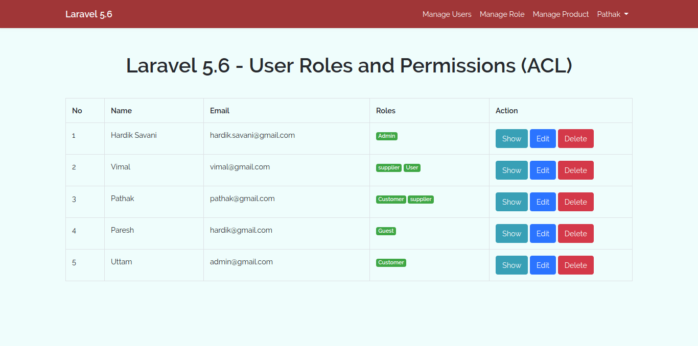

# Laravel 5.6 Installation

## Laravel 5.6 - User Roles and Permissions (ACL) using Spatie Tutorial

- https://itsolutionstuff.com/post/laravel-56-user-roles-and-permissions-acl-using-spatie-tutorialexample.html
	$ composer create-project --prefer-dist laravel/laravel lara_permissao

## Spatie Package Installation

Now we require to install Spatie package for ACL, that way we can use it's method. So Open your terminal and run bellow command.

	$ composer require spatie/laravel-permission

config/app.php

'providers' => [

	....

	Spatie\Permission\PermissionServiceProvider::class,

],

## Adicionar

- https://itsolutionstuff.com/post/html-form-not-found-in-laravel-5example.html

Add given bellow text to your composer.json file.

	"require": {
	"laravel/framework": "5.0.*",
	"laravelcollective/html": "~5.0"
	},

OR

	$ composer require laravelcollective/html

after fire composer update command After Update composer, open config/app.php and add this line to the ‘providers’ array:

'Collective\Html\HtmlServiceProvider',
Next, add these lines to the ‘aliases’ array:

'FORM' => 'Collective\Html\FormFacade',
'HTML' => 'Collective\Html\HtmlFacade',

Try this.........

We can also custom changes on Spatie package, so if you also want to changes then you can fire bellow command and get config file in config/permission.php.

	$ php artisan vendor:publish --provider="Spatie\Permission\PermissionServiceProvider" --tag="config"

	$ php artisan migrate

## Create Table using Migrations

In this step we have to create three migrations for as listed bellow tables:

1. users

2. products

3. roles

4. permissions

5. model_has_permissions

6. model_has_roles

7. role_has_permissions

So, if you install fresh project then you have already users table migration but if you don't have products table, so can create manually and other table can create using Spatie package command, so run bellow command and check migration file also.

	$ php artisan vendor:publish --provider="Spatie\Permission\PermissionServiceProvider" --tag="migrations"

	$ php artisan make:migrate create_products_table

- https://spatie.be/en/opensource/laravel

## Aconselho ha usar estes comandos tambem.
	$ composer require laravel/passport
	$ php artisan migrate
	$ php artisan passport:install
- No final start
	$ php artisan serve

- https://github.com/spatie/laravel-permission#database-seeding

- Renato de O. Lucena - Goiania 2018

## About Laravel

Laravel is a web application framework with expressive, elegant syntax. We believe development must be an enjoyable and creative experience to be truly fulfilling. Laravel attempts to take the pain out of development by easing common tasks used in the majority of web projects, such as:

- [Simple, fast routing engine](https://laravel.com/docs/routing).
- [Powerful dependency injection container](https://laravel.com/docs/container).
- Multiple back-ends for [session](https://laravel.com/docs/session) and [cache](https://laravel.com/docs/cache) storage.
- Expressive, intuitive [database ORM](https://laravel.com/docs/eloquent).
- Database agnostic [schema migrations](https://laravel.com/docs/migrations).
- [Robust background job processing](https://laravel.com/docs/queues).
- [Real-time event broadcasting](https://laravel.com/docs/broadcasting).

Laravel is accessible, yet powerful, providing tools needed for large, robust applications.

## License
Taylor Otwell via [taylor@laravel.com](mailto:taylor@laravel.com).
The Laravel framework is open-sourced software licensed under the [MIT license](https://opensource.org/licenses/MIT).
